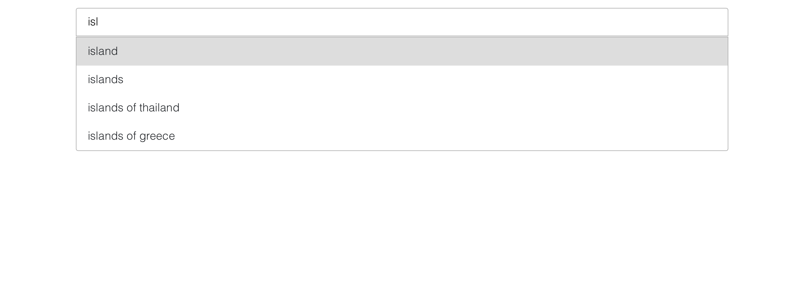

# Unsplash gallery clone made as a part of recruitment task.

The App uses Unsplash JSON API for photo search.

# Getting started

To access the Unsplash API, first register as a developer.

https://unsplash.com/documentation

After registering, copy API key, make a new .env file and place your key as below:

REACT_APP_ACCESS_KEY=your_api_key

# Screenshots

## Autosuggest component displaying suggestions only when input value is at least 3 characters long

## Responsive main gallery displayed after pressing ENTER key

## Modal window with informaton about the author and location of the photo displayed after clicking on a photo from the gallery

# Usage

This project was bootstrapped with [Create React App](https://github.com/facebook/create-react-app).

## Available Scripts

In the project directory, you can run:

### `yarn start`

Runs the app in the development mode. 
Open [http://localhost:3000](http://localhost:3000) to view it in the browser.

The page will reload if you make edits. 
You will also see any lint errors in the console.

## Important 

[Unplash](https://unsplash.com) is a registered trademark. This project was made just as a part of recruiment task and learning purposes.